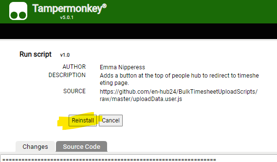
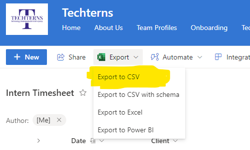

# Tampermonkey Timesheeting Scripts Repository

## Introduction

Welcome to this Repository! Here, you'll find scripts to upload timesheeting data fast.

## Pre-requisites

Before you can install and use our Tampermonkey scripts, ensure you have the following:

- Google Chrome browser installed on your device.
- Tampermonkey extension installed in Chrome. Tampermonkey is a popular userscript manager that allows you to install and manage custom scripts easily.

## Installing Tampermonkey

If you haven't installed Tampermonkey in your Chrome browser yet, follow these steps:

1. Go to the Chrome Web Store and search for "Tampermonkey," or visit the [Tampermonkey page](https://chromewebstore.google.com/detail/tampermonkey/dhdgffkkebhmkfjojejmpbldmpobfkfo) directly.
2. Click "Add to Chrome" to install the extension.
3. A confirmation dialog will appear. Click "Add extension" to proceed.

Once installed, you will see the Tampermonkey icon in the top right corner of your Chrome browser, indicating the extension is ready for use.

## Installing Tampermonkey Scripts from This Repository

To install the scripts from this repository

- Navigate to the Script: Browse through the repository and click on each script. Each script file should end with .user.js.
- View the Raw Script: Click on the desired script file, then click the "Raw" button to view the raw version of the script. This action should trigger Tampermonkey's installation window.

- Install the Script: In the Tampermonkey installation window, review the script code to ensure it's what you expect, then click "Install". The script will now be added to your Tampermonkey dashboard and automatically run on the websites it's designed for.

### Updating Scripts

Tampermonkey will automatically check for script updates by default. If you want to manually check for updates:

- Click the Tampermonkey icon in your browser's toolbar.
- Select "Dashboard".
- Go to the "Installed userscripts" tab.
- Click the "Check for userscript updates" button.

## Using Script

1. Go to [PeopleHub DashBoard](https://hub24.elmotalent.com.au/dashboard) and click payroll as per usual
2. Click the green "Go to Timesheets" button at top of page

3. Upload the timesheeting csv via the "Choose file" button (this CSV is downloaded from the lists as the "Export to CSV" option as pictured below)

4. Choose whether you are uploading for the current month, or last month
5. Press "UPLOAD TIMESHEETS"

